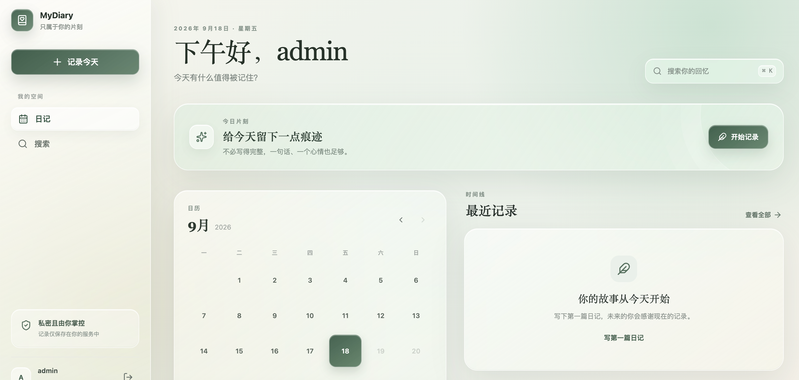
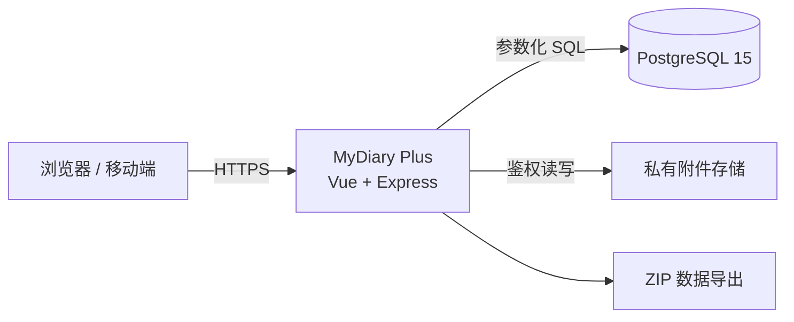

# MyDiary Plus

<p align="center">
  
</p>

<p align="center">
  一款为个人与家庭 NAS 设计的私有日记服务。数据留在自己的设备上，随时记录，也能完整导出。
</p>

<p align="center">
  Vue 3 · TypeScript · Express · PostgreSQL · Docker
</p>

## 界面预览

<table>
  <tr>
    <td width="50%" align="center"><strong>日历与历史时间线</strong></td>
    <td width="50%" align="center"><strong>沉浸式图文编辑</strong></td>
  </tr>
  <tr>
    <td></td>
    <td></td>
  </tr>
</table>

## 功能亮点

- **日历与时间线**：按日期查看记录，下滑连续浏览历史日记。
- **Markdown 图文日记**：支持心情 Emoji、图片上传、预览与自动保存。
- **搜索与回顾**：按内容检索，并从日历快速定位某一天。
- **离线保护**：网络异常时暂存草稿，恢复连接后继续同步。
- **完整数据导出**：将日记、Markdown 和附件打包为 ZIP，避免数据锁定。
- **私有与安全**：服务端会话、CSRF 防护、登录限流和附件鉴权访问。
- **适合 NAS**：单容器应用、PostgreSQL 持久化、健康检查及备份/恢复脚本。

首位注册用户会成为管理员，注册入口随后自动关闭。

## 架构



## Docker Compose 部署（推荐）

以下配置直接使用 GitHub Actions 发布到 Docker Hub 的多架构镜像，支持 `amd64` 和 `arm64`。新建部署目录，将内容保存为 `compose.yaml`：

```yaml
name: mydiary

services:
  db:
    image: postgres:15-alpine
    container_name: mydiary_db
    restart: unless-stopped
    environment:
      POSTGRES_USER: mydiary
      POSTGRES_DB: mydiary
      POSTGRES_PASSWORD_FILE: /run/secrets/db_password
    volumes:
      - ./postgres_data:/var/lib/postgresql/data
    healthcheck:
      test: ["CMD-SHELL", "pg_isready -U mydiary -d mydiary"]
      interval: 10s
      timeout: 5s
      retries: 5
      start_period: 30s
    secrets:
      - db_password

  app:
    image: k8sk3s/mydiaryplus:latest
    container_name: mydiary_app
    restart: unless-stopped
    ports:
      - "3000:3000"
    environment:
      NODE_ENV: production
      PORT: 3000
      DB_HOST: db
      DB_PORT: 5432
      DB_USER: mydiary
      DB_NAME: mydiary
      DB_PASSWORD_FILE: /run/secrets/db_password
      JWT_SECRET_FILE: /run/secrets/session_secret
      COOKIE_SECRET_FILE: /run/secrets/session_secret
      CORS_ORIGINS: ${APP_ORIGIN:-http://localhost:3000}
    depends_on:
      db:
        condition: service_healthy
    volumes:
      - ./uploads:/app/uploads
      - ./storage/attachments:/app/storage/attachments
      - ./storage/exports:/app/storage/exports
    healthcheck:
      test: ["CMD", "wget", "--no-verbose", "--tries=1", "--spider", "http://localhost:3000/api/health/ready"]
      interval: 30s
      timeout: 10s
      retries: 3
      start_period: 40s
    secrets:
      - db_password
      - session_secret

secrets:
  db_password:
    file: ./secrets/db_password.txt
  session_secret:
    file: ./secrets/session_secret.txt
```

创建目录和密钥：

```bash
mkdir -p secrets postgres_data uploads storage/attachments storage/exports
openssl rand -base64 32 > secrets/db_password.txt
openssl rand -hex 64 > secrets/session_secret.txt
chmod 600 secrets/*.txt
```

在同一目录新建 `.env`，填写 NAS 反向代理提供的 HTTPS 地址：

```dotenv
APP_ORIGIN=https://diary.example.com
```

启动并检查状态：

```bash
docker compose up -d
docker compose ps
docker compose logs -f app
curl http://localhost:3000/api/health/ready
```

通过 `APP_ORIGIN` 配置的地址访问应用。生产模式使用 Secure Cookie，除 `localhost` 外不应通过普通 HTTP 登录；请先在 NAS 反向代理中配置 HTTPS，并将流量转发到 `http://127.0.0.1:3000`。

网络环境无法直连 Docker Hub 时，可将两个 `image` 分别替换为：

```yaml
image: docker.6788266.xyz/docker.io/library/postgres:15-alpine
image: docker.6788266.xyz/docker.io/k8sk3s/mydiaryplus:latest
```

> 不要提交 `secrets/`、`.env` 或数据目录。若反向代理与 Docker 不在同一主机，请通过防火墙限制 `3000` 端口仅允许代理服务器访问。

## 从源码运行

### Docker 构建

```bash
git clone https://github.com/xevvexkkk/mydiaryPlus.git
cd mydiaryPlus
cp backend/.env.example .env
# 编辑 .env，至少填写 DB_PASSWORD 和长度不少于 32 位的 JWT_SECRET
docker compose up -d --build
```

完成后访问 <http://localhost:3000>。

### 本地开发

需要 Node.js 20+ 和 PostgreSQL 15。先根据 `backend/.env.example` 创建 `backend/.env`，再执行：

```bash
cd backend && npm install
cd ../frontend && npm install
cd .. && ./start.sh
```

前端开发服务器位于 <http://localhost:5173>，API 请求会代理到 `3000` 端口。也可分别运行 `cd backend && npm run dev` 和 `cd frontend && npm run dev`。

## 数据与维护

| 路径 | 内容 |
| --- | --- |
| `postgres_data/` | PostgreSQL 数据 |
| `storage/attachments/` | 私有图片附件 |
| `storage/exports/` | 临时导出文件（24 小时后清理） |
| `uploads/` | 旧版本兼容附件 |

NAS 备份与恢复脚本位于 `deploy/nas/`。脚本应与 `compose.yaml` 放在同一部署目录，确保其访问的 `storage/` 正是容器挂载目录：

```bash
./backup.sh
./restore.sh ./backups/backup-YYYYMMDD-HHMMSS
```

恢复操作会覆盖当前数据库和附件，请先保留现有数据副本。备份脚本依赖 `zstd`，恢复脚本还需要 `jq`。

## 项目结构

```text
frontend/          Vue 3 前端、页面与组件
backend/           Express API、迁移与数据库访问
deploy/nas/        NAS Compose、备份与恢复脚本
assets/screenshots README 界面截图
doc/               产品与设计文档
```

## 构建与贡献

提交前至少运行：

```bash
cd frontend && npm run build
cd ../backend && npm run typecheck
```

提交信息采用 Conventional Commits，例如 `feat: add diary timeline`、`fix: protect attachment access`。更多约定见 [AGENTS.md](./AGENTS.md)。
