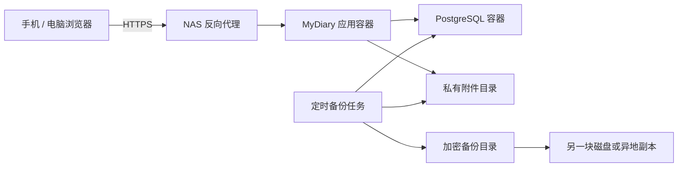

# MyDiary NAS 部署第一阶段设计方案

## 1. 目标与范围

第一阶段的目标是将 MyDiary 建设为一个可长期运行在自有 NAS 上的可靠服务，而不是扩展日记业务功能。

完成后应满足：

- 使用 Docker Compose 一键部署，支持 AMD64 和 ARM64 NAS。
- 数据库、日记和附件在容器重启或升级后保持完整。
- 支持个人数据导出、系统完整备份和恢复验证。
- 图片、注册、登录和密钥管理不存在明显安全缺口。
- 可通过健康检查发现数据库、存储和迁移异常。

本阶段暂不包含标签、统计、提醒、语音、位置天气、OIDC 和端到端加密。

## 2. 部署架构



部署约束：

- PostgreSQL 不映射到 NAS 外部端口。
- 应用端口只提供给 NAS 反向代理，公网访问统一使用 HTTPS。
- 数据库、附件、备份使用独立持久化目录。
- 生产镜像使用明确版本号，例如 `mydiary:1.0.0`，不直接使用 `latest`。
- 发布 `linux/amd64` 和 `linux/arm64` 镜像。Docker 支持用同一个镜像清单承载不同架构，参见 [Docker 多平台构建文档](https://docs.docker.com/build/building/multi-platform/)。

推荐 NAS 目录：

```text
/volume1/docker/mydiary/
├── postgres/
├── uploads/
├── backups/
├── secrets/
└── compose.yaml
```

## 3. 当前项目需要修复的问题

1. 后端在未配置 `JWT_SECRET` 时使用固定值 `secret`，应改为缺少强密钥时拒绝启动。
2. JWT 存储在 `localStorage`，一旦发生 XSS，令牌可能被读取。OWASP 建议使用 `HttpOnly; Secure; SameSite` Cookie，参见 [OWASP 会话管理指南](https://cheatsheetseries.owasp.org/cheatsheets/Session_Management_Cheat_Sheet.html)。
3. 注册接口始终开放，应在首个管理员创建后自动关闭。
4. `/uploads` 作为公开静态目录提供，知道 URL 即可绕过登录读取图片。
5. 上传接口缺少文件大小、真实类型和扩展名限制。
6. `backend/sql/init.sql` 没有 `images` 字段，但日记 API 正在读写该字段。
7. 当前只有初始化 SQL，没有可追踪的数据库迁移机制。

## 4. 身份认证与配置安全

### 4.1 服务端会话

使用服务端会话替代当前的长期 JWT：

```text
tb_sessions
- id: UUID
- user_id
- token_hash
- created_at
- expires_at
- last_used_at
- revoked_at
```

浏览器只保存随机会话 ID Cookie，数据库只保存令牌哈希。Cookie 设置 `HttpOnly`、`Secure` 和 `SameSite=Strict`。

同时实现：

- 首位注册用户自动成为管理员，随后关闭注册。
- 登录限流，例如同一 IP 每 15 分钟最多失败 10 次。
- 登出立即撤销会话；修改密码后撤销其他会话。
- 状态修改请求增加 CSRF 防护。
- 使用 Helmet 配置 CSP、`X-Content-Type-Options` 等安全响应头。
- 限制 CORS，仅允许实际部署域名。
- 数据库密码和会话密钥通过 Compose Secrets 文件挂载，参见 [Docker Compose Secrets](https://docs.docker.com/compose/how-tos/use-secrets/)。

## 5. 私有附件设计

新增附件表，不再在日记中直接保存公开 URL：

```text
tb_attachments
- id: UUID
- user_id
- diary_id
- storage_key
- original_name
- mime_type
- size_bytes
- sha256
- created_at
- deleted_at
```

文件使用随机 UUID 分层存储，例如：

```text
uploads/ab/cd/abcd...ef.webp
```

附件通过鉴权接口访问：

```http
GET /api/attachments/:id
```

后端验证附件属于当前用户后再返回文件。上传规则：

- 第一阶段只允许 JPEG、PNG、WebP 和 GIF。
- 禁止 SVG、HTML 和可执行文件。
- 单文件上限建议为 20 MB。
- 检查文件特征，不信任浏览器提供的 `Content-Type`。
- 文件存放在 Web 根目录之外。
- 下载响应设置 `X-Content-Type-Options: nosniff`。

具体原则参见 [OWASP 文件上传指南](https://cheatsheetseries.owasp.org/cheatsheets/File_Upload_Cheat_Sheet.html)。

## 6. 个人数据导出

“个人导出”和“系统备份”相互独立。个人导出生成可脱离 MyDiary 阅读和迁移的 ZIP：

```text
mydiary-export-2026-09-16.zip
├── manifest.json
├── entries.json
├── markdown/
│   └── 2026/09/2026-09-16.md
├── media/
└── checksums.sha256
```

`manifest.json` 至少包含：

```json
{
  "formatVersion": 1,
  "appVersion": "1.0.0",
  "exportedAt": "2026-09-16T10:00:00Z",
  "entryCount": 365,
  "attachmentCount": 120
}
```

建议接口：

```http
POST /api/exports
GET  /api/exports/:jobId
GET  /api/exports/:jobId/download
```

导出任务只能访问当前用户数据，生成文件在下载后或 24 小时后自动删除。

## 7. 系统备份与恢复

完整备份包含数据库、附件、应用版本、配置清单和校验值：

```text
backup-20260916-030000/
├── database.dump
├── uploads.tar.zst
├── manifest.json
└── SHA256SUMS
```

数据库使用 PostgreSQL 自定义格式：

```bash
pg_dump -Fc mydiary
```

该格式可使用 `pg_restore` 恢复，也适合跨机器架构迁移，参见 [PostgreSQL 备份文档](https://www.postgresql.org/docs/16/backup-dump.html)和 [pg_restore 文档](https://www.postgresql.org/docs/17/app-pgrestore.html)。

附件采用不可变文件设计。删除时先设置 `deleted_at`，物理清理仅在确认备份完成并超过保留期后执行，以避免数据库备份引用的文件消失。

保留策略：

- 每日备份保留 7 份。
- 每周备份保留 4 份。
- 每月备份保留 12 份。
- 至少一份加密副本保存到 NAS 之外。
- 每月自动恢复到临时数据库并执行完整性检查。

恢复流程必须文档化，并验证日记数量、附件数量和 SHA-256 校验值。

## 8. 健康检查

拆分存活和就绪检查：

```http
GET /api/health/live
GET /api/health/ready
```

- `live`：只确认 Node.js 进程正常响应。
- `ready`：执行数据库 `SELECT 1`，检查迁移版本、附件目录读写能力和磁盘剩余空间。

健康检查响应不得泄露数据库地址、目录路径、密钥或异常堆栈。Compose 应等待 PostgreSQL 健康后再启动应用，并为应用容器配置独立健康检查。

## 9. 数据库迁移策略

引入带版本号的迁移目录，替代启动时重复执行单一 `init.sql`：

```text
backend/sql/migrations/
├── 001_initial.sql
├── 002_add_diary_images.sql
├── 003_add_sessions.sql
├── 004_add_attachments.sql
└── 005_add_app_settings.sql
```

新增 `schema_migrations` 表记录已执行版本。迁移必须满足：

- 启动时只执行尚未应用的迁移。
- 迁移失败时应用拒绝进入就绪状态。
- 升级前自动创建备份。
- 破坏性字段删除至少跨两个版本完成，先停止使用，再删除字段。

## 10. 实施顺序

建议拆分为五个独立里程碑：

1. 数据库迁移机制、配置校验和缺失字段修复。
2. 服务端会话、Cookie、注册控制和登录限流。
3. 私有附件表、鉴权下载和上传校验。
4. JSON、Markdown 和媒体导出。
5. NAS Compose、备份恢复、双架构镜像和运维文档。

每个里程碑应包含自动化测试，至少覆盖未登录访问、跨用户访问、上传非法文件、导出数据隔离、迁移和恢复。

## 11. 验收标准

第一阶段只有在以下条件全部满足时才算完成：

- 全新 NAS 能通过一份 Compose 文件启动服务。
- 容器重启或版本升级后日记和附件保持完整。
- 未登录用户以及其他用户不能访问附件。
- 创建首个管理员后注册自动关闭。
- 缺少强密钥时应用拒绝启动。
- 非法类型或超限文件无法上传。
- 用户导出 ZIP 可以脱离应用阅读并通过校验。
- 完整备份能恢复到一套空环境。
- AMD64、ARM64 镜像均通过启动和健康检查。
- 恢复后日记数量、附件数量及 SHA-256 校验一致。
